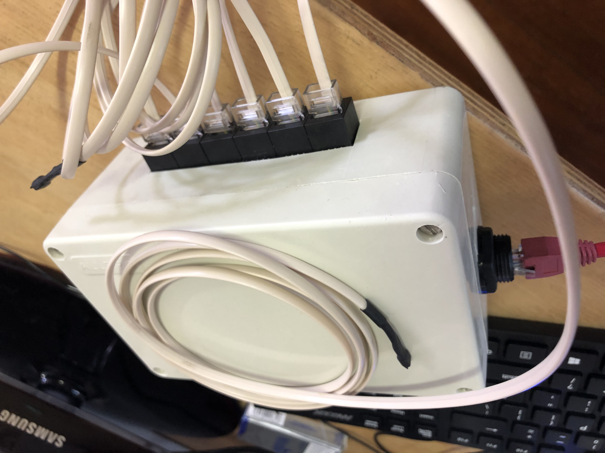
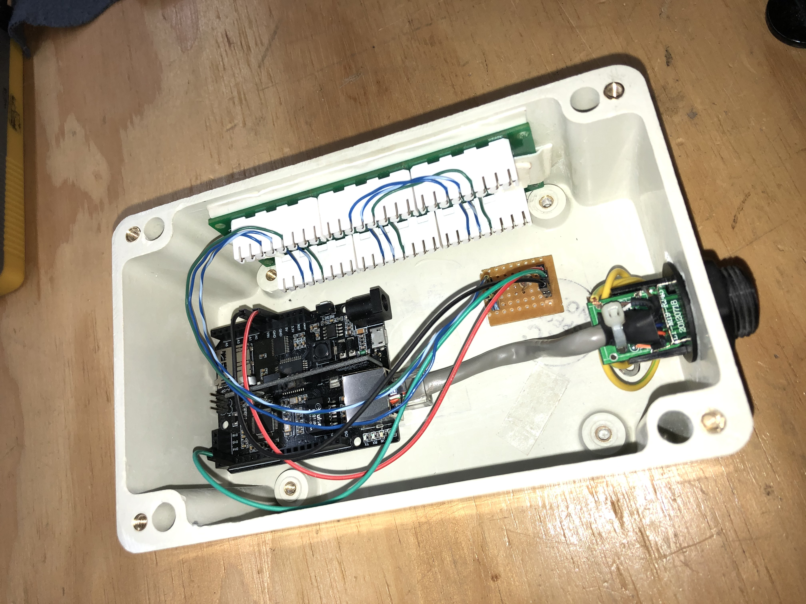
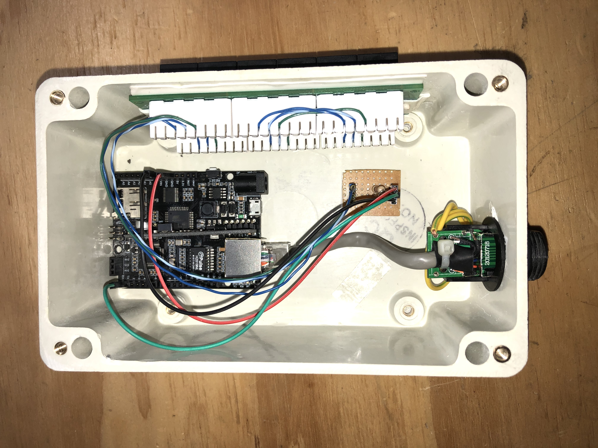
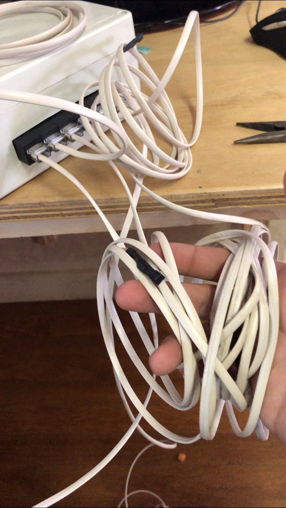
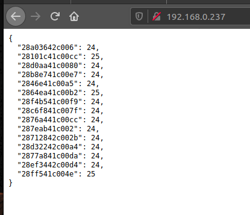

# MULTIPLE DS18B20 SENSORS ON A ONE-WIRE BUS
created by Jesse Davids.

**This project features multiple ds18b20 temperature sensors, all on a one wire bus. All sensors are identified by their unique serial number, accompanied by their sensor value. This data is sent to a web server, posted as JSON on a webpage. You can retrieve the data sent to the webpage into your network management software, graph it out and boom. Done.**

<h2>What you need to consider</h2>
  
* This repo supports only the DS18B20, other sensors have not yet been tested. You can feel free to do so.
* You will need a pull-up resistor, i used a 5K ohm resistor.
* Alter code to use up to 18 sensors.

<h2>Please check the pictures folder for a better understanding of the whole set-up</h2>

<h1>Sensor modification</h1>
1. We took old telephone cable and soldered it onto the sensor. On the other end of the cable we added a RJ45 connector.  
    
3. Took a piece of patch panel apart and connected it in-line with the RJ45 connector of the sensor.  
    
    
    
4. Added everything into a housing after testing.  
    

<h3>What the output should look like</h3>

